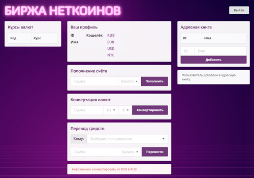

# Дипломное задание - 2 курс «Основы JavaScript»

Вы присоединились к команде, разрабатывающей сайт-биржу для крипто-стартапа. На этом сайте можно покупать внутреннюю валюту компании под названием **Неткоин** и передавать эту валюту другим пользователям сервиса. Вы подключаетесь на финальной стадии разработки проекта, поэтому основные его части уже реализованы: есть интерфейс взаимодействия с АPI (бэкендом, где производятся операции с пользователями и денежными средствами), и интерфейс взаимодействия с DOM (графическим интерфейсом, который вы видите в браузере). Ваша задача связать эти две части: сделать так, чтобы данные, введённые пользователем, отправлялись на сервер, а информация, предоставленная сервером, отобразилась пользователю.

## Структура проекта

В проекте есть две страницы, функционал которых вам нужно будет реализовать:

1. Страница «Вход и регистрация»:

Код для реализации функционала этой страницы пишите в файле `public/loginPage.js`.

Задание для страницы входа и регистрации находится по [ссылке](./md/loginpage.md).

1. Страница «Личный кабинет пользователя»:

Код для этой страницы пишите в файле `public/homePage.js`.

Задание для страницы личного кабинета находится по [ссылке](./md/homepage.md).

Файлы `public/loginPage.js` и `public/homePage.js` уже созданы для вас и подключены, дополнительная настройка не требуется.

